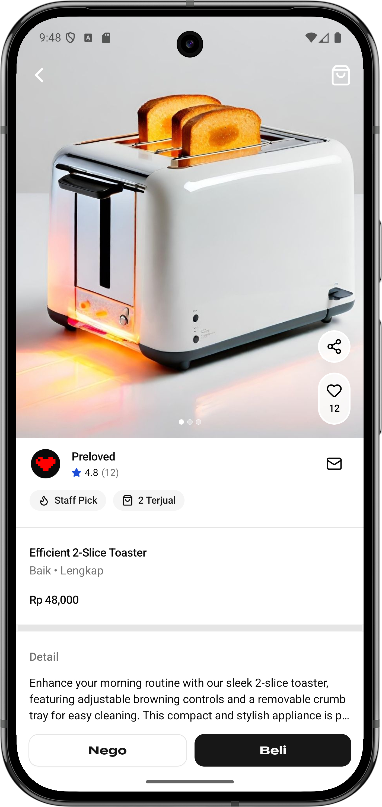
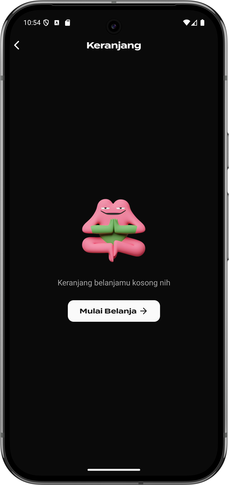
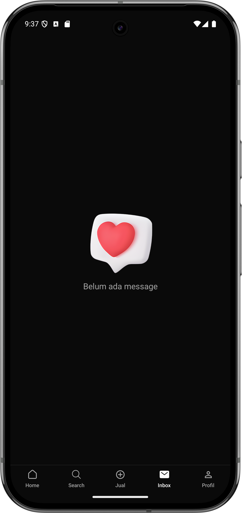

# 🏷️ Preloved Clone App

Clone frontend dari aplikasi [Preloved](https://preloved.co.id) — platform e-commerce jual beli barang fashion bekas terpercaya di Indonesia.

> **Catatan:** Ini adalah **learning project**. Hanya sisi frontend (UI/UX) yang diclone. Tidak ada backend, autentikasi, atau transaksi nyata. Data produk menggunakan [Platzi Fake Store API](https://api.escuelajs.co/api/v1).

---

## 📱 Preview

<div align="center">

|                                                        |                           Light Mode                           |                                                      |
| :----------------------------------------------------: | :------------------------------------------------------------: | :--------------------------------------------------: |
|  |  |  |

|                                                       |                      Dark Mode                       |                                                |
| :---------------------------------------------------: | :--------------------------------------------------: | :--------------------------------------------: |
|  |  |  |

</div>

---

## ✨ Fitur

- **Beranda** — Carousel produk (For You, Your Likes, Baru Dilihat), rekomendasi seller, dan hot items grid
- **Infinite Scroll** — Load lebih banyak produk otomatis saat scroll ke bawah
- **Filter Carousel** — Filter produk dengan animasi hide/show saat scroll
- **Multi-Image Card** — Setiap produk bisa punya banyak gambar dengan swipe carousel
- **Wishlist Button** — Animasi Lottie (lazy mount untuk performa optimal)
- **Pull-to-Refresh** — Refresh semua data sekaligus
- **Dark / Light Mode** — Support tema otomatis via NativeWind
- **Image Fallback** — Handling gambar rusak dari Platzi API secara otomatis

---

## 🛠️ Tech Stack

| Kategori     | Library                      |
| ------------ | ---------------------------- |
| Framework    | React Native + Expo SDK 52   |
| Routing      | Expo Router v4               |
| Server State | TanStack Query v5            |
| Animasi      | React Native Reanimated v3   |
| Styling      | NativeWind v4 (Tailwind CSS) |
| Image        | expo-image                   |
| Lottie       | lottie-react-native          |
| Language     | TypeScript                   |
| Data Source  | Platzi Fake Store API        |

---

## 📁 Struktur Proyek

```
preloved-clone/
├── app/
│   ├── (tabs)/
│   │   ├── index.tsx          # Halaman beranda
│   │   ├── explore.tsx        # Halaman explore
│   │   └── products.tsx       # Halaman produk + filter
│   ├── product/[id]/
│   │   └── index.tsx          # Detail produk
│   └── _layout.tsx            # Root layout + provider
│
├── components/
│   ├── ui/core/block/
│   │   ├── beranda-block.tsx  # Block utama beranda
│   │   └── explore-products.tsx
│   └── ui/fragments/
│       ├── custom/card/product-card.tsx
│       ├── custom/carousel/
│       └── shadcn-ui/image.tsx
│
├── lib/server/products/
│   ├── products-server.ts         # Fetch ke Platzi API
│   ├── products-queris-server.ts  # TanStack Query options
│   └── product-mappers.ts         # Transformasi data
│
└── type/
    └── products-type.ts           # TypeScript types
```

---

## 🚀 Cara Menjalankan

### Prasyarat

- Node.js 18+
- Expo CLI: `npm install -g expo-cli`
- iOS Simulator / Android Emulator **atau** Expo Go di HP

### Instalasi

```bash
# Clone repo
git clone https://github.com/username/preloved-clone.git
cd preloved-clone

# Install dependensi
npm install

# Jalankan
npx expo start
```

### Jalankan di device/simulator

```bash
# iOS
npx expo run:ios

# Android
npx expo run:android
```

---

## 🔌 API

Proyek ini menggunakan [Platzi Fake Store API](https://api.escuelajs.co/api/v1) sebagai sumber data dummy.

| Endpoint                       | Keterangan                                       |
| ------------------------------ | ------------------------------------------------ |
| `GET /products`                | Ambil daftar produk (dengan filter & pagination) |
| `GET /products/:id`            | Detail satu produk                               |
| `GET /categories`              | Daftar kategori                                  |
| `GET /categories/:id/products` | Produk per kategori                              |

---

## ⚙️ Konfigurasi TanStack Query

Provider sudah dikonfigurasi di `app/_layout.tsx` dengan:

```ts
const queryClient = new QueryClient({
  defaultOptions: {
    queries: {
      staleTime: 60 * 1000, // Data fresh selama 1 menit
      gcTime: 5 * 60 * 1000, // Cache disimpan 5 menit
      retry: 1, // Retry sekali jika gagal
    },
  },
});
```

**AppState integration** menggunakan `focusManager` (bukan `refetchQueries`) untuk mencegah cancel infinite scroll saat app kembali ke foreground:

```ts
AppState.addEventListener('change', (status) => {
  focusManager.setFocused(status === 'active');
});
```

---

## 🐛 Bug Fixes & Optimasi

Beberapa masalah teknis yang ditemukan dan diperbaiki selama pengerjaan:

| Masalah                                   | Fix                                                       |
| ----------------------------------------- | --------------------------------------------------------- |
| Header tertutup carousel saat scroll      | Header manual sebagai absolute View (bukan Stack.Screen)  |
| Infinite scroll delay / harus scroll lagi | `onMomentumScrollEnd` + `onScrollEndDrag` handlers        |
| ListFooter spinner stuck / tidak update   | `useRef` pattern + empty deps `useCallback` + `extraData` |
| Cache collision beranda vs explore        | `MAX_ITEMS` dimasukkan ke query key                       |
| App lag berat dengan banyak produk        | `React.memo` pada ProductCard + lazy mount LottieView     |
| `removeClippedSubviews` Android bug       | Hanya aktif di iOS                                        |
| `queryClient.refetchQueries()` deadlock   | Ganti ke `focusManager.setFocused()`                      |

---

## 📖 Referensi

- [Preloved App — App Store](https://apps.apple.com/id/app/preloved-buy-sell-fashion/id6502086431)
- [preloved.co.id](https://preloved.co.id)
- [Platzi Fake Store API](https://api.escuelajs.co/api/v1)
- [TanStack Query — React Native](https://tanstack.com/query/latest/docs/react/react-native)
- [Expo Router Docs](https://docs.expo.dev/router/introduction/)
- [React Native Reanimated](https://docs.swmansion.com/react-native-reanimated/)

---

## 📄 Lisensi

Proyek ini dibuat untuk tujuan belajar (educational purposes). Semua aset visual dan konsep UI mengacu pada aplikasi Preloved yang merupakan milik tim Preloved Indonesia.

---

<div align="center">
  <p>Made with ❤️ sebagai learning project</p>
  <p>Data by <a href="https://api.escuelajs.co/api/v1">Platzi Fake Store API</a></p>
</div>
